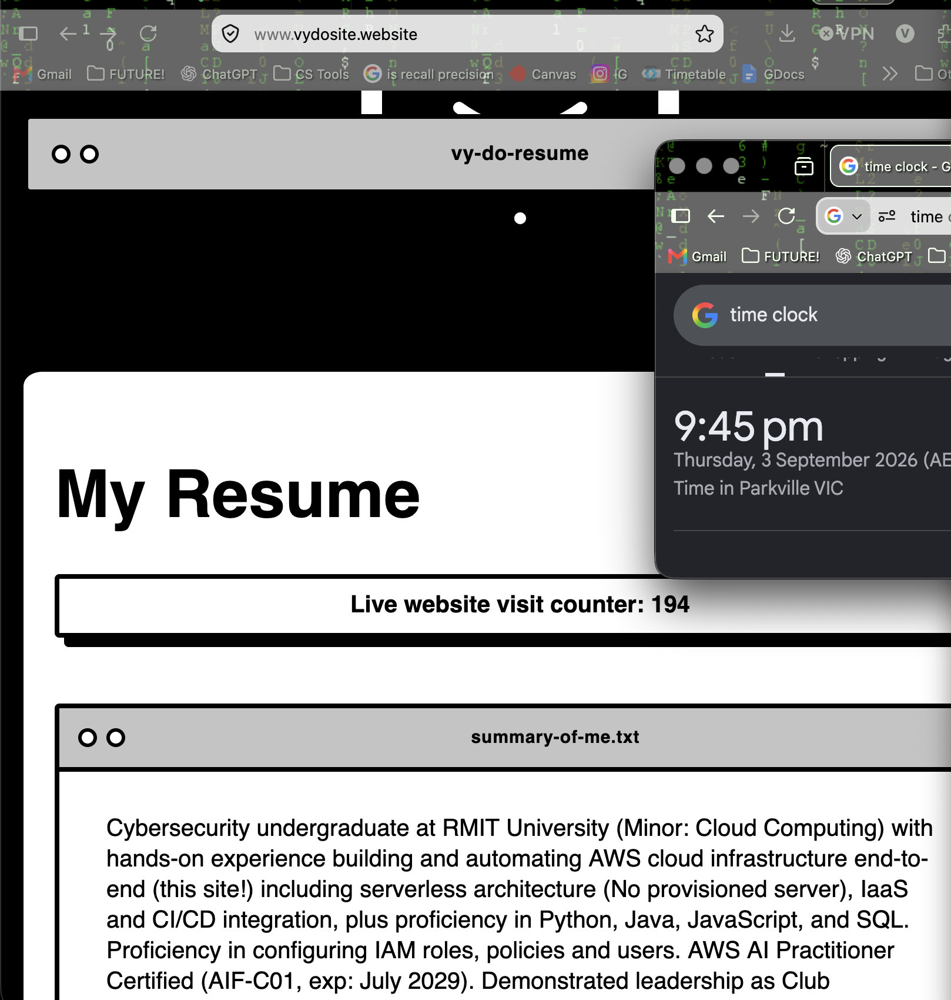
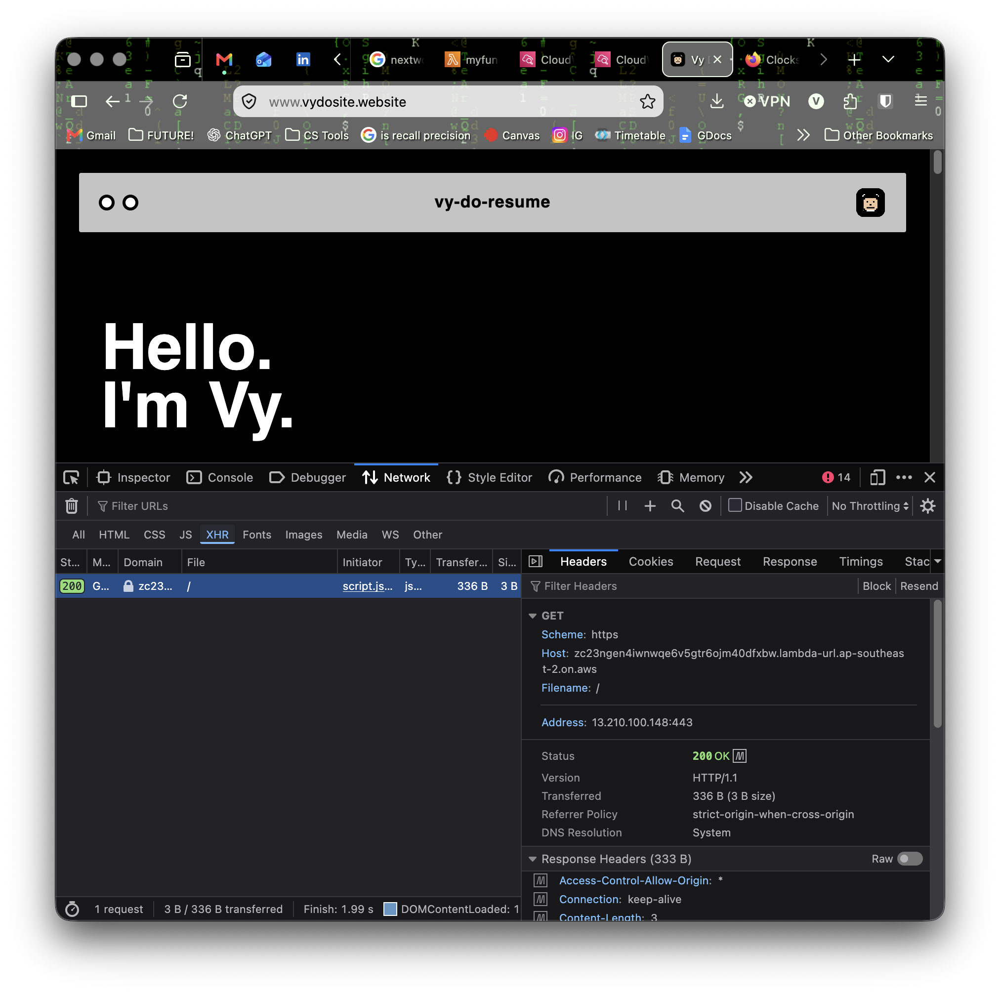
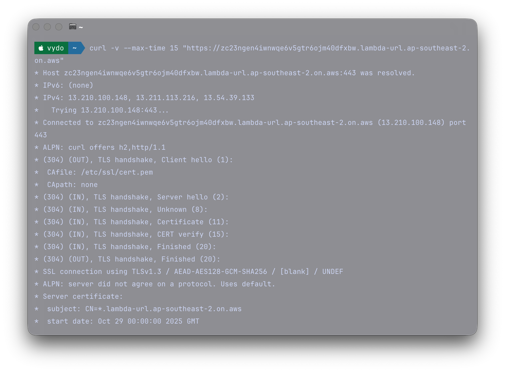
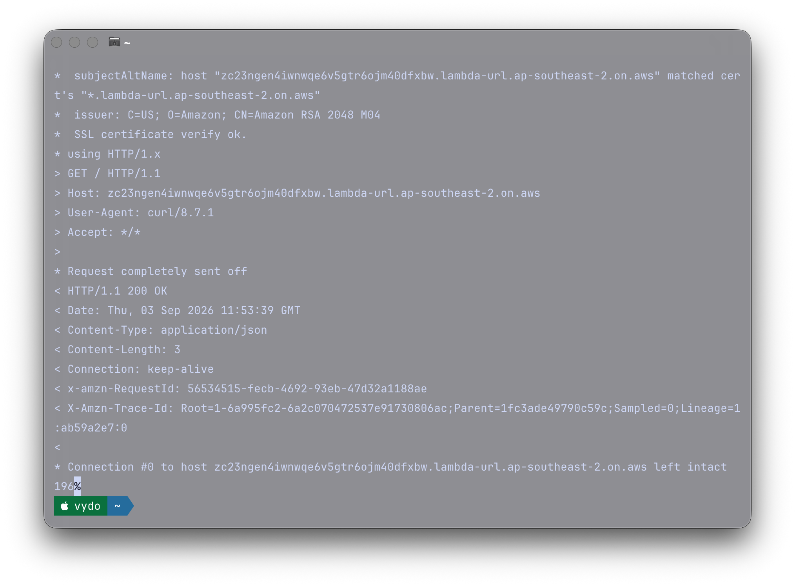
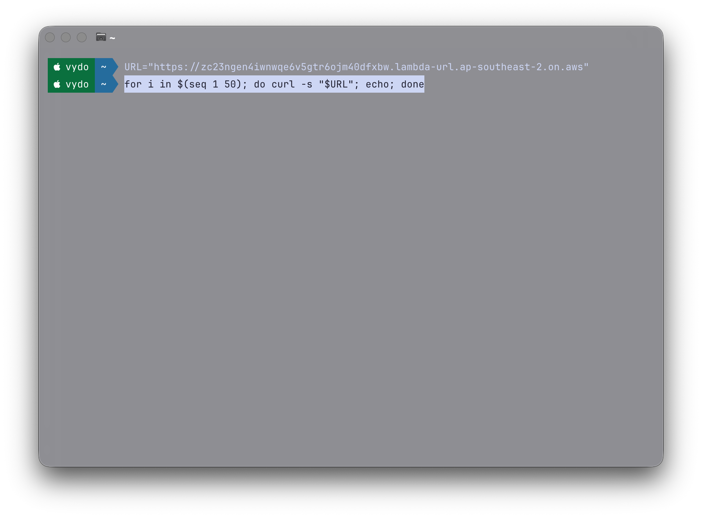
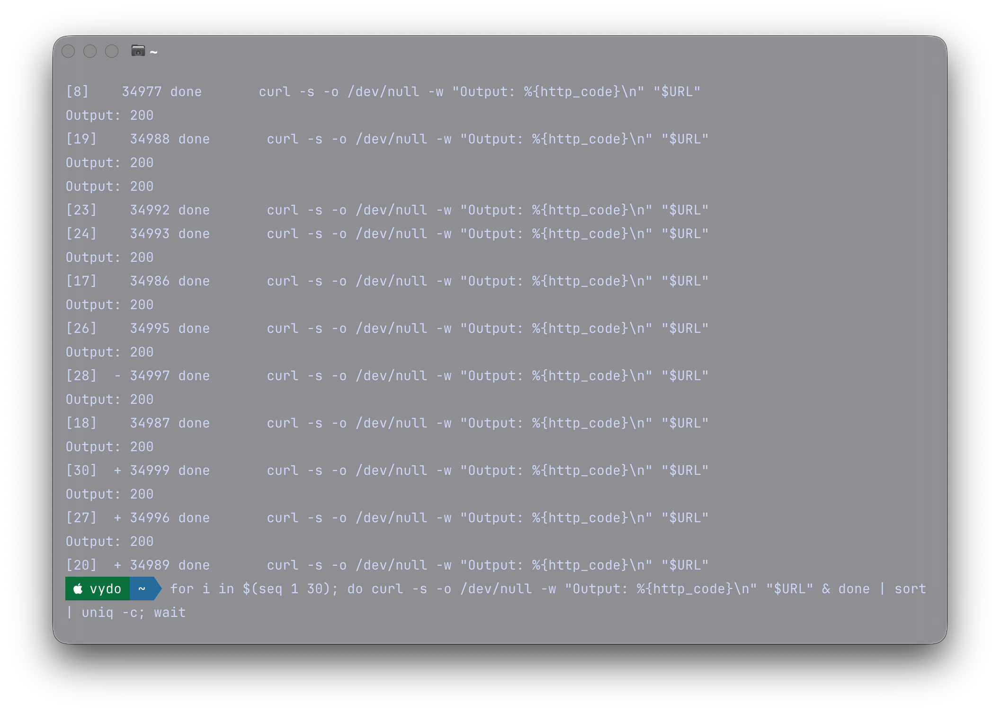
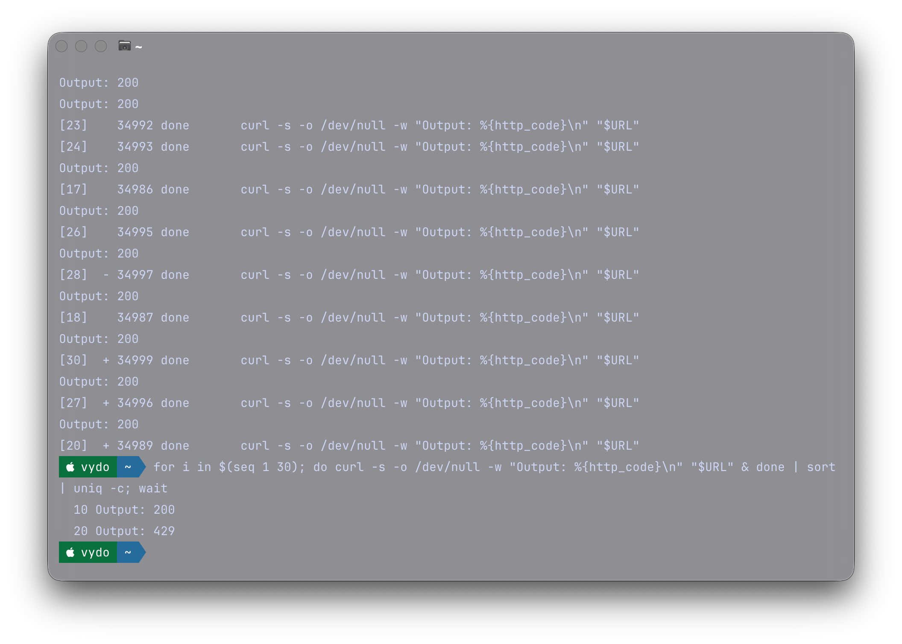
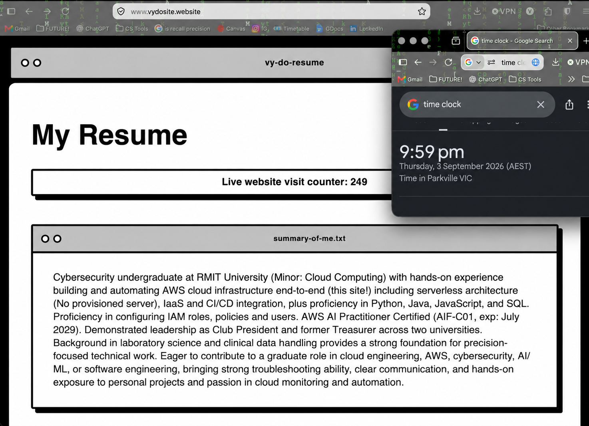
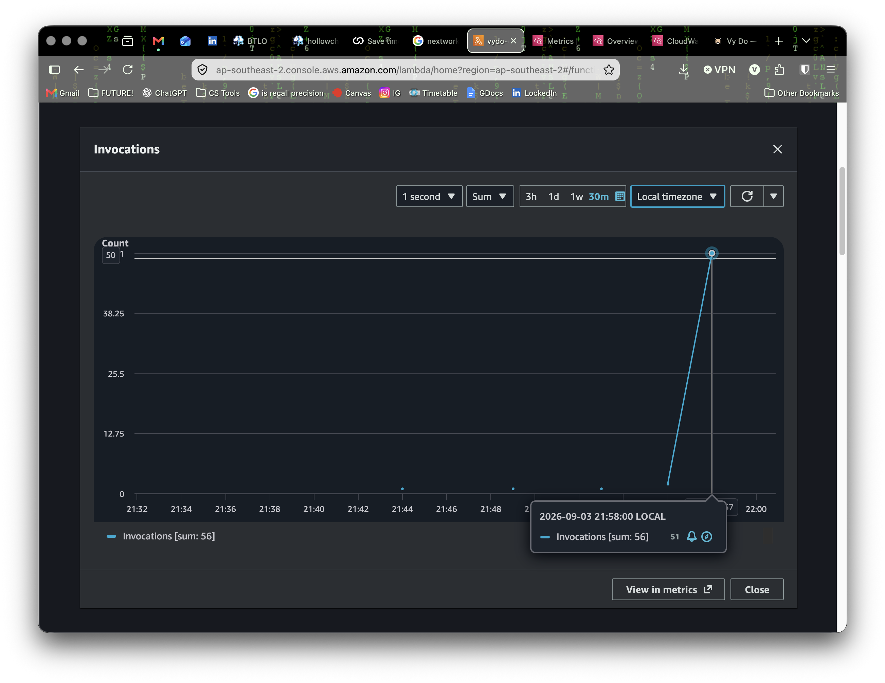
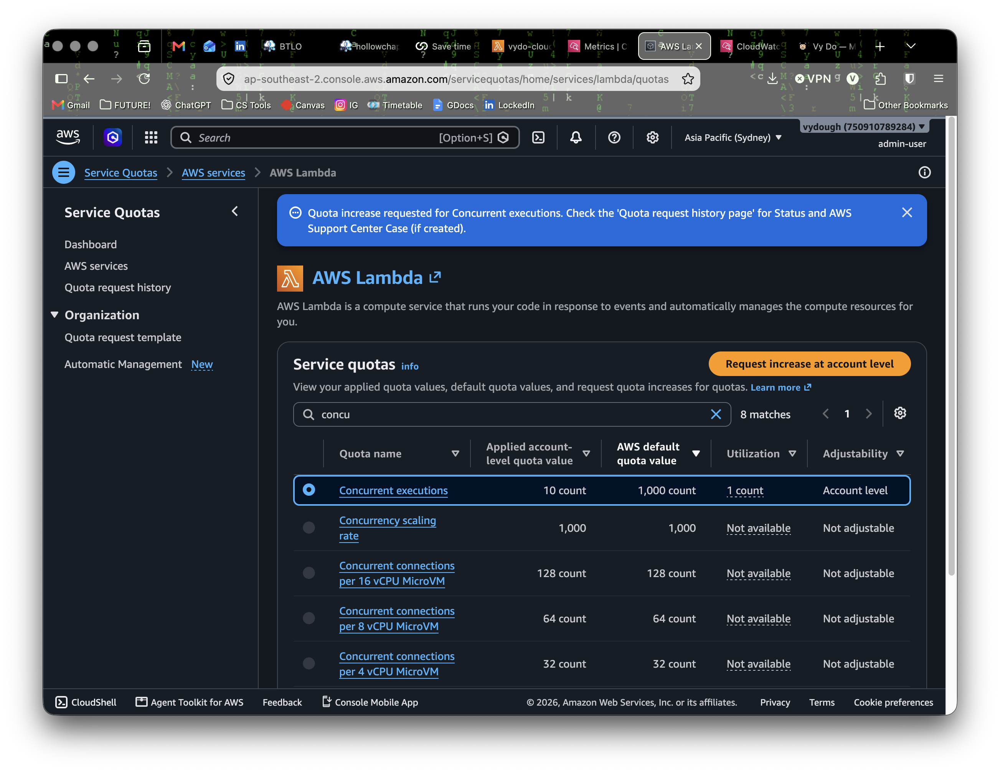

# Visitor-counter API: Abusing the counter outside the browser

A self-directed security exploration of the visitor-counter on my personal site previously completed from the Cloud Resume Challenge.
[vydosite.website] (https://www.vydosite.website/)

The counter is an AWS Lambda Function URL (Python, boto3) that increments an item in a DynamoDB table. 

The stack is provisioned via Terraform and the site is served from S3 + CloudFront. The counter is called by the frontend via a CORS policy that names my origin. 
I was intrigued on whether that policy actually protected my endpoint or just the browser itself. 

My question: If CORS is not authentication and not access control, can anything stop a client from calling the counter endpoint and intentionally incrementing it? 

## MY METHOD
Website visitor counter before investigation: 

The endpoint was identified via the DevTools Network Tab, which showed the exact request the page makes upon Ctrl + R (Refresh).

### Fig 1 - The counter's request in DevTools. The function URL is visible and exposed in the page source. 

### Fig 2 - Calling the function sequentially (50 requests, one after another

### Fig 3 - Calling the function  (30 requests at once) 

### Fig 4 - Updated Visitor counter after function was tested

## MY FINDINGS
### Fig 5 - Invocations spike shown on CloudWatch after calling function called concurrently (30 requests at once) 

### 1) The endpoint has no authentication and no rate limiting implemented
   - The single request returned 'HTTP 200" with the counter value in the body and can answer any client
   - curl is not a browser and does no ask for CORS headers
   - The sequential loop returned '200' 50x in a row and the site's counter increased by 50

Evidence for the impact: 
CORS was doing exactly what was expected. For this threat, it did not combat against it as it places no constraint on a direct client. The counter has no signed request, no IAM auth on the function URL and no rate limit. 
Any person/bot can inflate the count intentionally. 

### 2) The account concurrency maximum restricts a single burst in parallel, not sequential.

I fired 30 request simultaneously which produced a split result

There are 10 requests succeeded, whilst 20 were throttled with 429 Too Many Requests error. 

This output is as expected as my AWS account's Lambda restriction for 'concurrent-executions' quota is 10. 
This means that 10 requests fill the available execution slots and returned 200 whilst the other 20 had no slot and were rejected with 429. 

Concurrency restrictions limit how many executions can run at the same instant (capping at simultaneous flood). But, Sequential attacks don't use more than 1 concurrent execution as each curl is finished before the next begins. 

### Fig 6 - Account restrictions on concurrent executions 

So the concurrency limits does nothing against this cap. 

## THE AFTERMATH 

I wanted to implement a change upon this finding but it was not applicable for several reasons. 

1. The platform blocks increases in reserved concurrency as AWS has applied a whole account quote.

2. It is the wrong tool regardless as increasing the quota means it caps simultaneous executions - not sequential ones which is the real weakness.

### What security concept I had learned from this 
   - CORS is s browser policy and not access control
   - I learned that concurrency limits simultaneity, not volume
   - I learned the difference between rate and concurrency
   - The. security impact of this potentially experiencing a surge in the Lambda innovations and which can increase costs.

